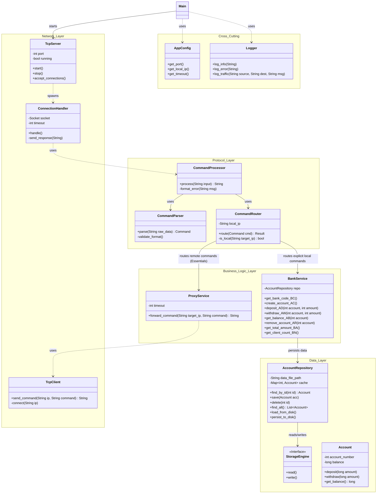

# ESSENTIALS BANK NODE - Architecture

## Class Diagram

## Description of Layers

1.  **Network Layer**: Handles TCP connectivity. `TcpServer` accepts connections, `ConnectionHandler` processes them, and `TcpClient` is used by the Proxy optimization to forward commands.
2.  **Protocol Layer**: Responsible for parsing text commands (`CommandParser`) and deciding where they go (`CommandRouter`). The router distinguishes between local commands (for `BankService`) and remote commands (for `ProxyService`).
3.  **Business Logic Layer**:
    *   `BankService`: Implements the bank logic (accounts, deposits, etc.) for *this* node.
    *   `ProxyService`: Forwards commands to other nodes if the generic bank code (IP) doesn't match the local one.
4.  **Data Layer**: Handles persistence. `AccountRepository` saves/loads accounts to disk so data is not lost on restart.
